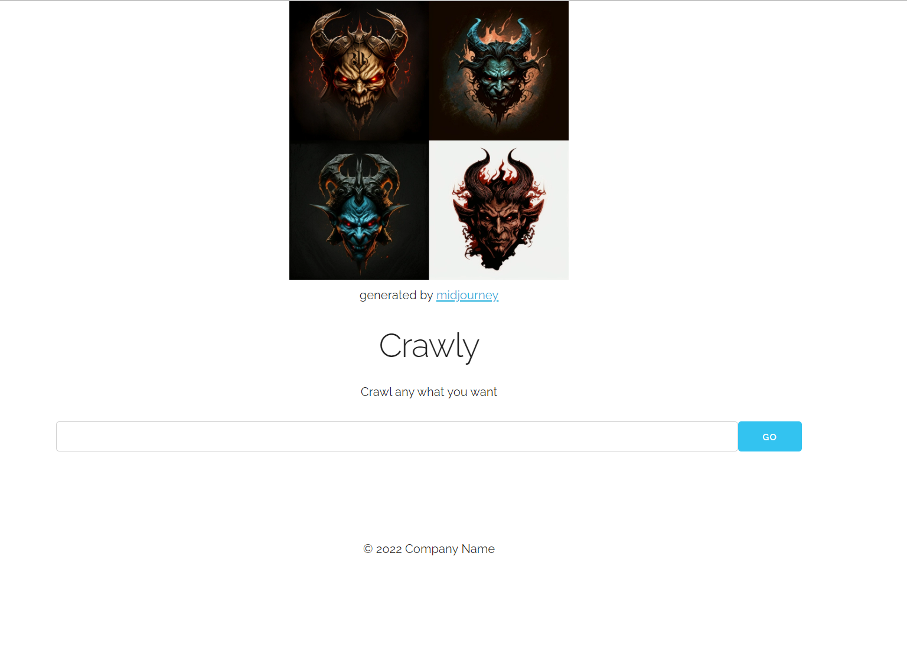

# Crawly - website scraper

Crawly is a website scraper written in Django. 
It is a simple tool that allows you to extract data from websites and save it to a database.

## Installation and usage

1. Clone the repository
2. Install requirements
3. Run migrations
4. Run the server
5. Create superuser
6. Call `python manage.py runcrons` to active the cron job
7. Go to http://localhost:8000 and input the URL you want to scrape  
8. Go to http://localhost:8000/job/{id} to see the state of the job
9. Go to http://localhost:8000/admin and monitor the progress

## How it works

Crawly uses Django's cron jobs to schedule the scraping. 
The cron job is called every 1 minutes and checks if there are any jobs that need to be scraped.